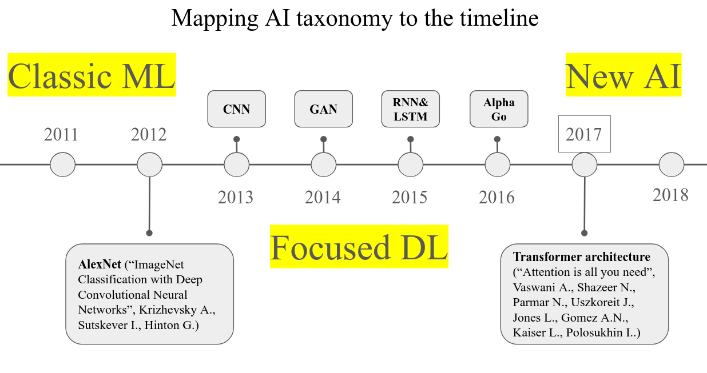

# AI-Assisted Literature Review: AI Methods in Sustainability Science

This repository contains the data and code for an AI-assisted literature review exploring the use of different AI methods in sustainability science.

Our goal was to get a big-picture view of which AI tools and methods are most common across different areas of sustainability research. To do this, we analyzed thousands of scientific articles published between 2020 and 2024.

The core of our analysis is based on a conceptual map of AI, which we call the "AI taxonomy." This taxonomy organizes AI methods into three main categories. We then looked at how these methods evolved over time, inspired by landmark papers like AlexNet (which kicked off the modern deep learning era) and the Transformer paper (which led to generative AI).

This evolutionary perspective helped us create three "generations" of AI for our analysis:

1.  **Classic ML:** Tools that were common before the deep learning boom (pre-AlexNet).
2.  **Focused DL:** Tools that emerged in the era between [AlexNet](https://proceedings.neurips.cc/paper_files/paper/2012/file/c399862d3b9d6b76c8436e924a68c45b-Paper.pdf) and the [Transformer](https://arxiv.org/pdf/1706.03762) paper.
3.  **New AI:** The latest tools that became popular after the Transformer paper, like large-scale generative models.

Here is a visual representation of this concept:

We used a locally run large language model (DeepSeek-R1-7B) to read the abstracts of over 8,500 relevant articles and extract keywords related to AI methods. This allowed us to map which "generation" of AI was used in different fields of sustainability science, from research on global risks to ocean challenges.

This approach, combining automated analysis with an evolutionary view of AI, allowed us to process a huge amount of information and identify broad trends in how AI is being applied to help solve some of the world's most pressing problems.

(c) [Erik Zhivkoplias](https://orcid.org/0000-0001-8492-5649) 2025
